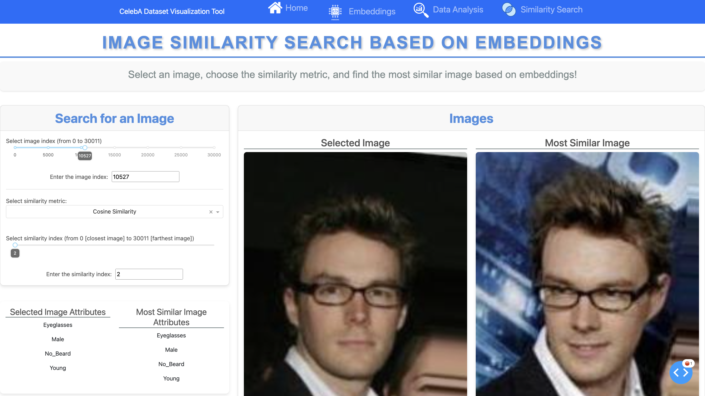

# CelebA-Explorer

### Interactive Visualization Platform for Celebrity Face Analysis

   

Explore 30,000 celebrity faces through advanced embeddings, similarity search, and dimensionality reduction techniques. Uncover hidden patterns in facial attributes with interactive visualizations.

**[Features](#features)** • **[Quick Start](#quick-start)** • **[Technology Stack](#technology-stack)**

---

## Overview

CelebA-Explorer is a powerful web-based platform for analyzing the CelebA dataset—a collection of 30,012 celebrity images annotated with 39 facial attributes and represented as 512-dimensional embeddings. This tool transforms raw data into actionable insights through interactive visualizations, similarity matching, and advanced clustering techniques.

### What is CelebA?

The **CelebFaces Attributes Dataset** is a large-scale face dataset containing:
- **200,000+ celebrity images** (30,012 in this subset)
- **39 binary facial attributes** (Smiling, Male, Eyeglasses, Bald, Young, etc.)
- **512-dimensional embeddings** capturing facial features in latent space

### What makes CelebA Explorer special?

- **Intelligent Search**: Find visually similar faces using cosine similarity or Euclidean distance
- **Interactive Analytics**: 5 dynamic visualizations revealing patterns in attributes and embeddings
- **Advanced Clustering**: Group faces with K-Means, DBSCAN, and Agglomerative methods
- **Dimensionality Reduction**: Visualize high-dimensional embeddings in 2D with PCA, t-SNE, MDS, LLE, and Isomap
- **Attribute Weighting**: Generate synthetic faces by combining weighted facial features
- **Real-time Filtering**: Refine data subsets with AND/OR logic on facial attributes
- **Responsive Design**: Clean, intuitive interface built with Dash and Bootstrap

---

## Screenshots

### Home Page
<p align="center">
    
</p>

*Dynamic landing page with rotating sample images and quick access to all features*

### Similarity Search
<p align="center">
    
</p>

*Find the most similar faces using customizable distance metrics and K-nearest neighbors*

---

## Features

### Similarity Matching

- **K-Nearest Neighbors Search**: Find the top-K most similar faces
- **Dual Distance Metrics**:
  - **Cosine Similarity**: Measures angle between embedding vectors
  - **Euclidean Distance**: Measures spatial distance in embedding space
- **Visual Comparison**: Side-by-side attribute comparison of selected and similar images
- **Interactive Selection**: Browse dataset and select any image as query

### Data Analysis

**Static Statistics**
- Total image count and embedding dimensionality
- Attribute distribution and prevalence analysis
- Most/least frequent facial features

**Interactive Visualizations**
1. **Correlation Matrix**: Linear relationships between 39 facial attributes
2. **Co-occurrence Matrix**: Patterns of attributes appearing together
3. **Feature Distribution**: Balance of binary attributes across dataset
4. **Embedding Distribution**: Range and spread of embedding dimensions
5. **Feature-Embedding Correlation**: How attributes relate to latent space

**Dynamic Controls**
- Adjustable thresholds for attribute presence/absence
- Filter by specific features or embedding dimensions
- Real-time chart updates based on selections

### Embedding Exploration

**Weighted Similarity Search**
- Assign custom weights to each of the 39 facial attributes
- Generate synthetic embeddings from weighted averages
- Find real images most similar to synthetic profiles

**Data Filtering**
- **AND Logic**: Images must have ALL selected attributes
- **OR Logic**: Images must have ANY selected attributes
- Combine multiple filters for precise data subsets

**Clustering Algorithms**
- **K-Means**: Partition data into K distinct clusters
- **DBSCAN**: Density-based clustering for arbitrary shapes
- **Agglomerative**: Hierarchical clustering with linkage options

**Dimensionality Reduction**
- **PCA**: Principal Component Analysis for linear projections
- **t-SNE**: Preserve local structure with non-linear mapping
- **MDS**: Multidimensional Scaling preserving pairwise distances
- **LLE**: Locally Linear Embedding for manifold learning
- **Isomap**: Geodesic distance preservation on manifolds

**Advanced Parameters**
- Fine-tune perplexity, learning rates, and iterations (t-SNE)
- Adjust neighbors, metrics, and solvers (LLE, Isomap)
- Customize cluster counts and linkage criteria

---

## Quick Start

### Prerequisites

- Python 3.9 or higher
- pip package manager
- 4GB+ RAM recommended for large-scale clustering

### Installation

1. **Clone the repository**
   ```bash
   git clone https://github.com/mathisdelsart/CelebA-Explorer.git
   cd CelebA-Explorer
   ```

2. **Install dependencies**
   ```bash
   pip install -r requirements.txt
   ```

3. **Prepare the dataset**
   
   Create a `Datas/` folder and download the CelebA dataset:
   ```bash
   mkdir Datas
   # Download from https://www.kaggle.com/datasets/jessicali9530/celeba-dataset
   # Rename to: Datas/celeba_buffalo_l.csv
   ```

4. **Prepare image assets**
   
   Place celebrity images in the `assets/` folder (images should match dataset entries)

5. **Launch the application**
   ```bash
   python app.py
   ```

6. **Access the web interface**
   
   Open your browser to `http://127.0.0.1:8050`

---

## Project Structure

```
CelebA-Explorer/
├── app.py                      # Main application entry point
├── requirements.txt            # Python dependencies
├── Datas/
│   └── celeba_buffalo_l.csv   # CelebA dataset (download separately)
├── assets/
│   ├── home_page.png          # Screenshot - Home
│   ├── similar_page.png       # Screenshot - Similarity
│   └── [celebrity_images]/    # Image files from dataset
├── pages/
│   ├── home.py                # Landing page with image carousel
│   ├── data_analysis.py       # Statistical analysis & visualizations
│   ├── similarity_embed.py    # Similarity search interface
│   └── embeddings.py          # Advanced embedding exploration
├── utils/
│   ├── app_utils.py           # Navigation & helper functions
│   ├── clustering_utils.py    # K-Means, DBSCAN, Agglomerative
│   ├── data_analysis_utils.py # Correlation, co-occurrence, distributions
│   ├── embeddings_utils.py    # PCA, t-SNE, MDS, LLE, Isomap
│   └── similarity_embeddings_utils.py  # Distance metrics & KNN
├── report.pdf                 # Detailed project documentation
└── guideline.pdf              # Project specifications
```

---

## Technology Stack

### Frontend & Framework
- **Dash**: Reactive web framework for Python
- **Plotly**: Interactive, publication-quality charts
- **Dash Bootstrap Components**: Responsive UI elements
- **HTML/CSS**: Custom styling and layouts

### Data Processing
- **Pandas**: Data manipulation and analysis
- **NumPy**: Numerical computing and array operations

### Machine Learning
- **Scikit-learn**: Clustering and dimensionality reduction algorithms
- **PCA**: Linear dimensionality reduction
- **t-SNE**: Non-linear manifold learning
- **K-Means**: Partitional clustering
- **DBSCAN**: Density-based clustering
- **MDS, LLE, Isomap**: Advanced manifold learning

### Similarity Metrics
- **Cosine Similarity**: Angular distance in embedding space
- **Euclidean Distance**: L2 norm in high-dimensional space

---

## Usage

### Exploring the Dataset

1. **Home Page**: View randomly sampled celebrity faces (refreshes every 3 seconds)
2. **Navigate**: Use top navigation bar to access different features

### Finding Similar Faces

1. Navigate to **Similarity Search**
2. Select an image index or browse the dataset
3. Choose distance metric (Cosine/Euclidean)
4. Set K (number of neighbors)
5. Compare attributes of original and similar images

### Analyzing Patterns

1. Navigate to **Data Analysis**
2. Explore 5 interactive visualizations
3. Adjust thresholds for attribute presence
4. Identify most/least common facial features
5. Discover correlations between attributes

### Advanced Exploration

1. Navigate to **Embeddings**
2. **Weighted Search**: Assign weights to attributes → find matching faces
3. **Filter Data**: Apply AND/OR logic on facial features
4. **Cluster**: Group similar faces with K-Means, DBSCAN, or Agglomerative
5. **Visualize**: Project 512D embeddings to 2D using PCA, t-SNE, MDS, LLE, or Isomap
6. **Fine-tune**: Adjust algorithm parameters for optimal results

---

## Academic Context

This project was developed as part of **LDATA2010 - Information Visualization** at UCLouvain. It demonstrates practical implementation of:

- Interactive data visualization with Dash and Plotly
- Dimensionality reduction techniques (PCA, t-SNE, MDS, LLE, Isomap)
- Clustering algorithms (K-Means, DBSCAN, Agglomerative)
- Similarity metrics for high-dimensional embeddings
- Visual analytics for exploratory data analysis
- Responsive web application design
- Scalable data processing pipelines

---

## Documentation

For detailed information about the project implementation, methodology, and results, please refer to:
- [report.pdf](report.pdf): Comprehensive project report
- [guideline.pdf](guideline.pdf): Project specifications and requirements

---

## Author

<div align="center">

<table>
  <tr>
    <td width="180" align="left">
      
    </td>
    <td align="left">
      <strong>Mathis DELSART</strong>
    </td>
  </tr>
</table>

</div>

## License

This project is developed for academic purposes as part of university coursework.

---

<div align="center">

**Built for LDATA2010 - Information Visualization @ UCLouvain** (Université catholique de Louvain).

*An interactive platform for celebrity face analysis*

</div>